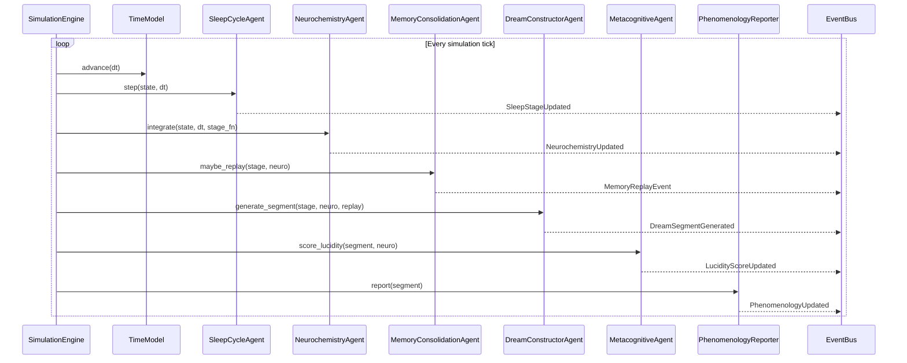
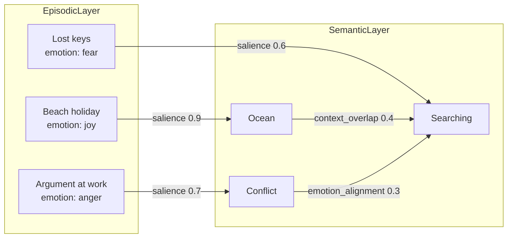

# DreamForge AI — System Architecture

> "The first open-source AI system that thinks while it sleeps."

## 1. Overview

DreamForge AI is a hierarchical multi-agent simulation of human dreaming that couples:
- A biophysically-inspired sleep–wake regulation model (Borbély two-process model: Process S + Process C).
- Neurochemical dynamics of key transmitters and hormones across REM/NREM (acetylcholine, serotonin, noradrenaline, cortisol).
- Memory consolidation and hippocampal replay over a weighted, emotionally tagged knowledge graph.
- Dream content generation via LLM-backed agents.
- Metacognitive and phenomenological layers (lucidity, bizarreness, narrative reporting).
- A real-time, interactive visualization stack (Dash/Streamlit + D3/Plotly) for "watching" dreams unfold.

The system is designed as a **7-layer agent hierarchy** orchestrated by a central OrchestratorAgent, with communication over a typed, Pydantic-validated event bus and simulated sleep-cycle time.

---

## 2. High-Level Component Diagram

```mermaid
flowchart TD
    subgraph SimulationCore["Simulation Core"]
        TM[TimeModel]
        EB[EventBus]
        ENG[SimulationEngine]
    end

    subgraph Models["Biophysical & Cognitive Models"]
        SC[SleepCycleModel<br/> (Process S + C)]
        NC[NeurochemistryModel<br/>(ACh, 5-HT, NE, cortisol)]
        MG[MemoryGraph<br/>(NetworkX)]
        DS[DreamSegmentModel]
    end

    subgraph Agents["Multi-Agent Hierarchy"]
        ORCH[Layer 0: OrchestratorAgent]
        SCAG[Layer 1: SleepCycleAgent]
        NCAG[Layer 2: NeurochemistryAgent]
        MCAG[Layer 3: MemoryConsolidationAgent]
        DCAG[Layer 4: DreamConstructorAgent]
        META[Layer 5: MetacognitiveAgent]
        PHEN[Layer 6: PhenomenologyReporter]
    end

    subgraph Infra["Infra & Interfaces"]
        API[FastAPI REST Layer]
        REDIS[(Redis)]
        VIS[Visualization Dashboard<br/>(Dash/Streamlit + D3)]
        LLM[LLM Backend<br/>(GPT-4o / Claude / Ollama)]
    end

    TM --> ENG
    ENG --> EB
    EB <--> ORCH

    ORCH <--> SCAG
    ORCH <--> NCAG
    ORCH <--> MCAG
    ORCH <--> DCAG
    ORCH <--> META
    ORCH <--> PHEN

    SCAG <--> SC
    NCAG <--> NC
    MCAG <--> MG
    DCAG <--> DS

    ENG <--> REDIS
    ORCH <--> REDIS

    ENG --> VIS
    ENG --> API
    DCAG <--> LLM
    PHEN <--> LLM
```

---

## 3. Agent Hierarchy & Responsibilities

```mermaid
flowchart TD
    ORCH[Layer 0: OrchestratorAgent]

    subgraph L1["Layer 1: SleepCycleAgent"]
        SCA[SleepCycleAgent]
        REMA[REMAgent]
        NREMA[NREMAgent N1/N2/N3]
    end

    subgraph L2["Layer 2: NeurochemistryAgent"]
        NCA[NeurochemistryAgent]
        AChA[AcetylcholineAgent]
        SERA[SerotoninAgent]
        NEA[NoradrenalineAgent]
    end

    subgraph L3["Layer 3: MemoryConsolidationAgent"]
        EMA[EpisodicMemoryAgent]
        SEMA[SemanticNetworkAgent]
        ETag[EmotionalTaggingAgent]
    end

    subgraph L4["Layer 4: DreamConstructorAgent"]
        NW[NarrativeWeaver]
        SB[SceneBuilder]
        CS[CharacterSpawner]
    end

    subgraph L5["Layer 5: MetacognitiveAgent"]
        LM[LucidityMonitor]
        RC[RealityCheckerAgent]
    end

    subgraph L6["Layer 6: PhenomenologyReporter"]
        PR[PhenomenologyReporter]
    end

    ORCH --> SCA
    ORCH --> NCA
    ORCH --> EMA
    ORCH --> SEMA
    ORCH --> ETag
    ORCH --> NW
    ORCH --> SB
    ORCH --> CS
    ORCH --> LM
    ORCH --> RC
    ORCH --> PR

    SCA --> REMA
    SCA --> NREMA

    NCA --> AChA
    NCA --> SERA
    NCA --> NEA
```



### Layer Descriptions

- **Layer 0 — OrchestratorAgent**
  - Owns the simulation clock and coordinates all other agents.
  - Subscribes to `SleepStageUpdated`, `NeurochemistryUpdated`, `MemoryReplayEvent`, `DreamSegmentGenerated`, `LucidityScoreUpdated`, `PhenomenologyUpdated` messages.
  - Maintains cross-night continuity, runs counterfactual batches, and controls parameter sweeps.

- **Layer 1 — SleepCycleAgent**
  - Wraps `SleepCycleModel` implementing Borbély's two-process model (Process S homeostatic + Process C circadian).
  - Produces moment-by-moment estimates of Process S/C and discretises into Wake / N1 / N2 / N3 / REM stages.
  - Empirical constraints: N3 dominant in first third of night; REM periods lengthen toward morning; average cycle ~90 minutes.
  - Emits `SleepStageUpdated` and `HypnogramPoint` events.

- **Layer 2 — NeurochemistryAgent**
  - Wraps `NeurochemistryModel` (ODE system) to simulate ACh, 5-HT, NE, and cortisol conditioned on sleep stage and pharmacology.
  - Implements REM-specific dynamics: near-silencing of monoaminergic neurons (5-HT, NE) and high cholinergic tone (monoamine hypothesis of REM).
  - Feeds back into DreamConstructorAgent (vividness, bizarreness prior) and MetacognitiveAgent (lucidity likelihood).
  - Accepts pharmacological perturbations via `PharmacologyUtils`.

- **Layer 3 — MemoryConsolidationAgent**
  - Wraps `MemoryGraph` (NetworkX MultiDiGraph) with episodic, semantic, and emotional layers.
  - Simulates hippocampal sharp-wave ripple (SWR) events as bursty replay sequences (biased random walks).
  - Applies selective forgetting: low-salience memories decay; emotionally intense memories are partially protected.
  - Injects reweighted fragments into DreamConstructorAgent.

- **Layer 4 — DreamConstructorAgent**
  - Composes narrative segments from current sleep stage, neurochemistry, active memory fragments, and external variables.
  - Uses LLM backend (GPT-4o / Claude / Ollama) to generate dream segments.
  - Computes bizarreness metrics: discontinuities, incongruities, implausibility scores (Revonsuo-inspired index).

- **Layer 5 — MetacognitiveAgent**
  - Tracks lucidity probability as a function of sleep stage, neurochemistry, and cognitive consistency.
  - Models MILD/WILD/DILD induction protocols.
  - Injects reality-testing failures and bizarre logic constraints.

- **Layer 6 — PhenomenologyReporter**
  - Produces first-person narratives, affect labels, and optional Jungian symbolic interpretations.
  - Responsible for human-readable outputs, JSON "dream files," and export to visualization and API.

---

## 4. Simulation & Time Model



- **TimeModel**: Simulated time resolution configurable (e.g. 0.5 min ticks). Maps 8-hour night onto <30 seconds wall time.
- **SimulationEngine**: Drives main loop, coordinates agents, records snapshots to Redis.
- **EventBus**: Typed Pydantic-validated messages, publish/subscribe semantics, supports Redis Streams for distributed deployment.

---

## 5. Data Models

| Model | Location | Key Fields |
|---|---|---|
| `SleepCycleModel` | `core/models/sleep_cycle.py` | Process S/C, stage, cycle_index, tau_wake, tau_sleep |
| `NeurochemistryModel` | `core/models/neurochemistry.py` | ACh, 5-HT, NE, cortisol ODE state; SSRI/pharmacology modifiers |
| `MemoryGraph` | `core/models/memory_graph.py` | NetworkX MultiDiGraph; nodes with activation/salience/emotion; SWR replay |
| `DreamSegment` | `core/models/dream_segment.py` | timestamp, stage, neuro_snapshot, narrative_text, bizarreness_scores, emotional_state |

---

## 6. Neurochemistry ODE System

State vector \(y = [\text{ACh}, \text{5-HT}, \text{NE}, \text{Cortisol}]\)

Dynamics for each species follow:

```
dACh/dt  = r_ACh(stage)  - k_clear_ACh  × ACh
d5HT/dt  = r_5HT(stage)  - k_clear_5HT  × 5HT
dNE/dt   = r_NE(stage)   - k_clear_NE   × NE
dCort/dt = cortisol_drive(t) - k_clear_cort × Cort
```

Stage-dependent production rates enforce monoamine hypothesis:
- **REM**: `r_5HT ≈ 0.05`, `r_NE ≈ 0.05` (near-silent), `r_ACh = 1.5` (peak)
- **NREM**: intermediate
- **Wake**: all at basal

Solved via SciPy `solve_ivp` with configurable max_step.

---

## 7. Memory Graph



- Nodes: memory fragments with `activation`, `salience`, `emotion`, `arousal`, `recency_hours`
- Edges: `weight`, `emotion_alignment`, `context_overlap`
- SWR replay: biased random walk starting from high-salience nodes
- Selective forgetting: exponential decay modulated by emotional arousal

---

## 8. Visualization Stack

| Panel | Technology | Update Rate |
|---|---|---|
| Sleep Hypnogram | Plotly / Dash | Real-time, per tick |
| Neurochemical Flux | Plotly multi-line | Real-time, per tick |
| Memory Association Graph | D3.js force-directed | On replay event |
| Dream Content Timeline | Custom HTML/JS | On segment generated |
| Agent Activity Heatmap | Plotly heatmap | Per tick |
| Inter-agent Message Flow | Plotly Sankey | Accumulated |

All charts support SVG/PNG/JSON export. Dark mode and colorblind-accessible palettes (Okabe-Ito/Viridis).

---

## 9. API Endpoints

```
POST   /api/simulation/night    Run one full-night simulation
POST   /api/simulation/batch    Run multiple nights / counterfactual variants
GET    /dream/{id}              Retrieve dream report as structured JSON
GET    /dream/{id}/narrative    First-person narrative text
GET    /visualization/{id}      Data feeds for frontend charts
GET    /health                  Service health check
```

Full OpenAPI schema available at `/docs` (FastAPI auto-generated).

---

## 10. Novel Features

| Feature | Implementation |
|---|---|
| **Pharmacological Modulator** | `NeurochemistryParameters.ssri_factor` + `core/utils/pharmacology.py` |
| **Cross-Night Continuity** | `MemoryGraph` + OrchestratorAgent state persisted in Redis |
| **Counterfactual Dream Engine** | Parameter sweeps over memory weights, emotional tags, stress inputs |
| **Lucidity Induction Simulator** | MetacognitiveAgent MILD/WILD/DILD policy modes |
| **Collective Dream Field** | N parallel simulations with shared `MemoryGraph` fragments |

---

## 11. Deployment

```bash
git clone https://github.com/JToSound/dreamforge-ai
cd dreamforge-ai && docker-compose up
# Dashboard: http://localhost:8501
# API docs:  http://localhost:8000/docs
```

See `docker-compose.yml` for full service definitions (app, Redis, Streamlit dashboard).

---

## 12. Scientific References

1. Borbély, A.A. (1982). A two process model of sleep regulation. *Human Neurobiology*, 1(3), 195–204.
2. Hobson, J.A., McCarley, R.W. (1977). The brain as a dream state generator. *American Journal of Psychiatry*, 134(12), 1335–1348.
3. Stickgold, R. (2005). Sleep-dependent memory consolidation. *Nature*, 437, 1272–1278.
4. Revonsuo, A. (2000). The reinterpretation of dreams. *Behavioral and Brain Sciences*, 23(6), 877–901.
5. Jouvet, M. (1999). *The Paradox of Sleep*. MIT Press.
6. Walker, M. (2017). *Why We Sleep*. Scribner.
